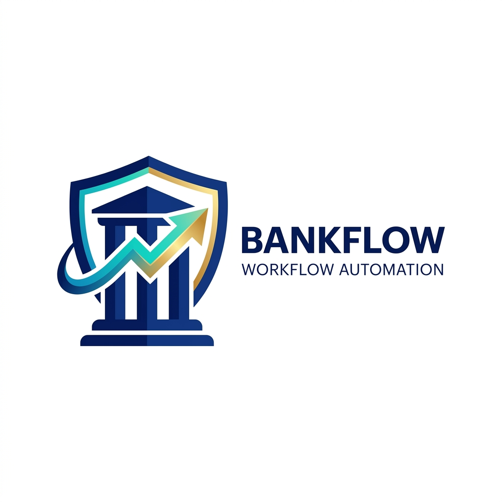
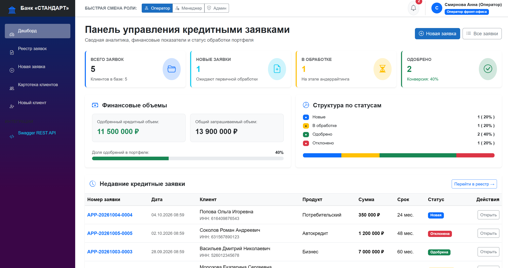
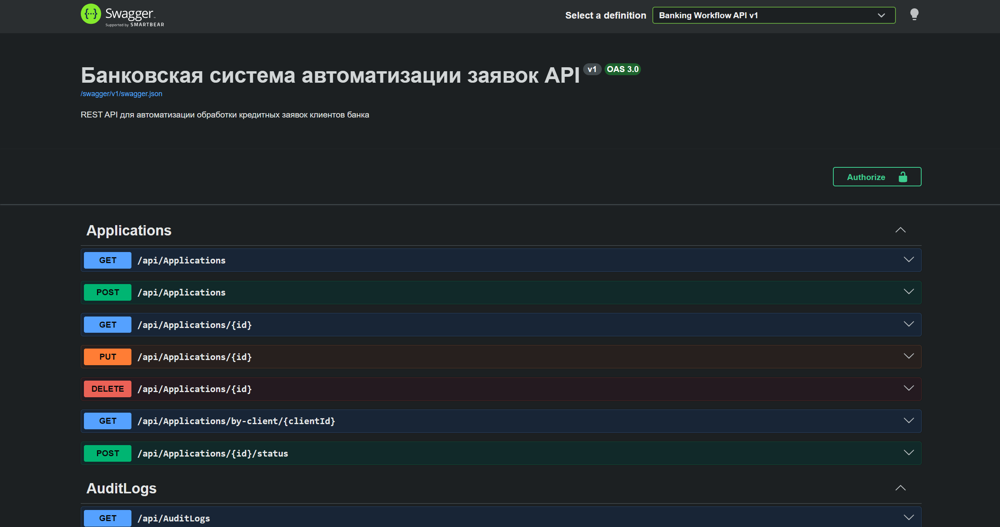

<p align="center">
  
</p>

<h1 align="center">BankFlow — Система автоматизации банковских заявок</h1>

<p align="center">
  <strong>Промышленное решение для автоматизации кредитного конвейера, скоринга, андеррайтинга и электронного документооборота банка</strong>
</p>

<p align="center">
  
  
  
  
  
  
  
  
  
</p>

---

## 📸 Скриншоты интерфейса

### 1. Аналитический Дашборд и мониторинг портфеля
> Сводные финансовые метрики, конверсия одобрений, распределение статусов портфеля и последние поступившие заявки.

<p align="center">
  
</p>

### 2. Карточка заявки, скоринг и жизненный цикл
> Детализация финансовых условий, параметры аннуитета, скоринговый профиль клиента, прикрепленные документы и хронологический аудит переходов статусов.

<p align="center">
  
</p>

---

## 📌 О проекте

**BankFlow** — веб-система для банковских организаций, автоматизирующая полный цикл работы с кредитными заявками физических лиц и корпоративных клиентов:

* **Фронт-офис:** Регистрация клиентов, ввод параметров кредита, автоматический расчет аннуитетных платежей и показателя долговой нагрузки (ПДН / DTI), прикрепление подтверждающих документов.
* **Андеррайтинг и риски:** Перевод заявок в обработку, проверка кредитного скоринга, принятие решения кредитным комитетом (Одобрение / Отказ) с обязательным документированием причины.
* **Юридический документооборот:** Формирование официального кредитного договора по банковскому шаблону в формате `.docx` (OpenXML) и выписки из протокола решения.
* **Аналитика и регуляторная отчетность:** Выгрузка реестра заявок в стилизованный Excel-файл (`.xlsx`, ClosedXML) с цветовыми индикаторами статусов и финансовым форматированием.
* **Безопасность и комплаенс:** Ролевая модель доступа (Оператор, Менеджер, Администратор), журнал аудита всех действий пользователей, REST API с JWT-авторизацией.

---

## 🏛️ Архитектура системы

Проект спроектирован по принципам **Clean Architecture** (Чистая Архитектура) и Domain-Driven Design (DDD):

```
BankingWorkflowSystem/
├── docs/
│   └── images/                          # Логотип и скриншоты проекта
├── src/
│   ├── BankingWorkflow.Domain/          # Чистые доменные сущности, Enum, State Machine и Domain Exceptions
│   ├── BankingWorkflow.Application/     # DTO-модели, интерфейсы бизнес-сервисов, валидаторы FluentValidation
│   ├── BankingWorkflow.Infrastructure/  # EF Core, PostgreSQL, ASP.NET Identity, ClosedXML, OpenXML, хранилище
│   └── BankingWorkflow.Web/             # Хост: ASP.NET Core Web API (JWT) + Swagger + Blazor Interactive Server
├── tests/
│   └── BankingWorkflow.Tests/           # Автоматические тесты (xUnit): 16 тестов логики, формул и валидаций
├── .github/
│   └── workflows/ci.yml                 # Непрерывная интеграция GitHub Actions (CI)
├── docker-compose.yml                   # Готовый Docker Compose манифест для PostgreSQL и Web-приложения
├── Dockerfile                           # Multi-stage production сборка приложения
└── README.md                            # Руководство пользователя и разработчика
```

### Разделение ответственности слоев

1. **`BankingWorkflow.Domain`** — ядро системы. Не имеет зависимостей от сторонних библиотек и БД. Инкапсулирует бизнес-правила жизненного цикла заявки (`NEW` → `IN_PROGRESS` → `APPROVED` / `REJECTED`) и расчет аннуитета.
2. **`BankingWorkflow.Application`** — слой сценариев использования. Содержит сервисные интерфейсы, DTO и правила валидации (`FluentValidation`).
3. **`BankingWorkflow.Infrastructure`** — инфраструктурный слой. Реализует доступ к PostgreSQL через EF Core, работу с ASP.NET Identity, генерацию отчетов ClosedXML и документов OpenXML.
4. **`BankingWorkflow.Web`** — слой представления и интеграций. Предоставляет доступ по REST API (OpenAPI/Swagger) и интерактивный Blazor UI с серверным рендерингом.
5. **`BankingWorkflow.Tests`** — набор модульных тестов для валидаторов, доменных правил и математических вычислений.

---

## 🛠️ Стек технологий

| Технология | Версия / Пакет | Описание и назначение |
| :--- | :--- | :--- |
| **C# / .NET** | **.NET 10 (LTS)** | Современная производительная платформа с поддержкой новейших языковых конструкций |
| **Web API** | **ASP.NET Core** | REST API контроллеры для интеграции с внешними системами |
| **Frontend UI** | **Blazor Interactive Server** | Высокопроизводительный серверный интерактивный веб-интерфейс без задержек |
| **ORM** | **Entity Framework Core 10** | Объектно-реляционное отображение, миграции и оптимизированные LINQ-запросы |
| **Database** | **PostgreSQL 16** | Надежная реляционная СУБД промышленного уровня |
| **Аутентификация** | **ASP.NET Identity + JWT** | Хеширование паролей, управление ролями, Bearer токены для REST API |
| **Excel экспорт** | **ClosedXML** | Формирование стилизованных `.xlsx` отчетов с цветными бейджами и форматированием |
| **Word генератор** | **DocumentFormat.OpenXml** | Официальный OpenXML SDK Microsoft для формирования `.docx` договоров по шаблону |
| **Валидация** | **FluentValidation** | Строгая проверка паспортов РФ, ИНН, возраста совершеннолетия 18+ и диапазонов |
| **Документация API**| **Swashbuckle / Swagger** | Интерактивная консоль тестирования REST API с поддержкой JWT |
| **Контейнеризация** | **Docker & Docker Compose** | Изолированная среда выполнения с автоматическим стартом и healthcheck |
| **Тестирование** | **xUnit** | Модульное и интеграционное тестирование доменной логики |

---

## 🔄 Жизненный цикл заявки (State Machine)

В системе реализован строгий контроль переходов статусов:

```
[ NEW (Новая) ]
       │
       ▼ (Взятие в работу: Оператор / Менеджер / Админ)
[ IN_PROGRESS (В обработке) ]
       │
       ├─────────────────────────────────────────┐
       ▼ (Одобрение: Менеджер / Админ)            ▼ (Отказ: Менеджер / Админ)
[ APPROVED (Одобрена) ]                  [ REJECTED (Отклонена) ]
 (Финальный статус: генерация договора)   (Финальный статус: фиксация причины)
```

* Переход `NEW` → `APPROVED` напрямую **запрещен** бизнес-логикой.
* Оператор фронт-офиса **не имеет права** принимать финальное решение об одобрении или отказе.
* При переводе в `APPROVED` или `REJECTED` обязательно указание комментария/заключения андеррайтера.
* Все изменения фиксируются в таблице `application_status_histories` и общем журнале аудита `audit_logs`.

---

## 👥 Роли и тестовые учетные записи

При первом запуске база данных автоматически инициализируется демонстрационными пользователями:

| Email | Пароль | Роль | ФИО | Возможности |
| :--- | :--- | :--- | :--- | :--- |
| `admin@bank.local` | `Admin123!` | **Admin** | Администратор Системы | Полный доступ ко всем модулям, журналу аудита и управлению |
| `manager@bank.local` | `Manager123!` | **Manager** | Иванов Петр Сергеевич | Принятие решений (`APPROVED`/`REJECTED`), договоры, Excel, аудит |
| `operator@bank.local` | `Operator123!` | **Operator** | Смирнова Анна Дмитриевна | Регистрация заемщиков, оформление заявок, перевод `NEW` → `IN_PROGRESS` |

> 💡 **Быстрое переключение:** В шапке сайта предусмотрены кнопки переключения ролей в 1 клик для удобного тестирования разграничения прав.

---

## 🚀 Быстрый старт

### Вариант 1: Запуск через Docker Compose (рекомендуется)

1. Клонируйте репозиторий:
   ```bash
   git clone https://github.com/your-username/BankingWorkflowSystem.git
   cd BankingWorkflowSystem
   ```
2. Запустите контейнеры:
   ```bash
   docker compose up -d
   ```
3. Откройте в браузере:
   * **Веб-приложение:** `http://localhost:5000`
   * **Swagger REST API:** `http://localhost:5000/swagger`

---

### Вариант 2: Локальный запуск через .NET CLI

1. Запустите контейнер базы данных PostgreSQL:
   ```bash
   docker compose up -d postgres
   ```
2. Примените миграции EF Core (база создастся и наполнится автоматически):
   ```bash
   dotnet ef database update --project src/BankingWorkflow.Infrastructure --startup-project src/BankingWorkflow.Web
   ```
3. Запустите веб-проект:
   ```bash
   dotnet run --project src/BankingWorkflow.Web --launch-profile "http"
   ```
4. Приложение будет доступно по адресу:
   * **Веб-интерфейс:** `http://localhost:5142`
   * **Swagger:** `http://localhost:5142/swagger`

---

## 🧪 Запуск тестов

Для запуска всех автоматических тестов выполните:

```bash
dotnet test
```

Результат выполнения:
```text
Пройден! : не пройдено 0, пройдено 16, пропущено 0, всего 16 - BankingWorkflow.Tests.dll
```

---

## 📄 Лицензия

Проект распространяется под открытой лицензией [MIT](LICENSE).
